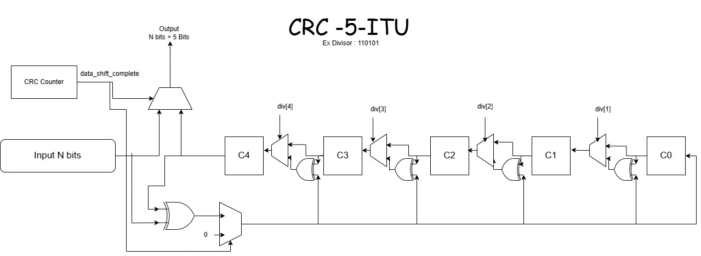

# CRC-Hardware-Implementation
A flexible and configurable CRC (Cyclic Redundancy Check) calculator implemented in Verilog RTL with MATLAB golden reference model for verification. Supports arbitrary data and divisor bit widths for error detection in digital communication systems.

>Developed as part of studying Telecommunication Networks - Data Link Layer lecture on Error Control mechanisms.

## Example Diagram 


## 📁 Project Structure

```
.
│   README.md
│
├───Matlab Model
│       crc_polynomial_division.m
│       crc_polynomial_division_Live_Script.mlx
│
├───RTL
│       CRC.v
│       CRC_counter.v
│
└───TB
        CRC_tb.v
```

## ✨ Features

- **Fully Parameterized Design**: Configurable data width and divisor width
- **Hardware Optimized**: Efficient polynomial division using XOR operations
- **MATLAB Golden Model**: Reference implementation for verification
- **Comprehensive Testbench**: Multiple test cases with automatic pass/fail checking
- **Standard CRC Support**: Compatible with CRC-5, CRC-8, CRC-16, and custom polynomials

## 🚀 Quick Start

### Prerequisites

**For Verilog Simulation:**
- ModelSim, Vivado, or any Verilog simulator
- Basic knowledge of HDL simulation

**For MATLAB Model:**
- MATLAB R2016b or later

## 📖 How to Use

### Run MATLAB Model
```matlab
% In Matlab Model folder
data = [1 0 1 0 0 0 1 1 0 1];      % Your data bits
divisor = [1 1 0 1 0 1];            % Your divisor (must start/end with 1)
[crc, full_output] = crc_calculator(data, divisor, true);
```

### Run Verilog Testbench
```bash
iverilog -o crc_sim RTL/*.v TB/CRC_tb.v
vvp crc_sim
```

### Change Input/Divisor/Bit Width

**In TB/CRC_tb.v:**
```verilog
parameter DATA_WIDTH = 10;  // Change data bits
parameter DIV_WIDTH = 6;    // Change divisor bits

run_test(
    10'b1010001101,         // Your data
    6'b110101,              // Your divisor
    15'b___,                
    "Test name"
);
```

**Important:** 
- Output width will be: `DATA_WIDTH + DIV_WIDTH - 1`
- Divisor **must** start and end with `1` (e.g., `110101`, `100101`, `111111`)

---

**Timing:**
1. Assert `valid_in` for **one clock cycle** with data and divisor
2. Wait for `valid_out` to assert (takes `DATA_WIDTH + DIV_WIDTH - 1` cycles)
3. Read `crc_data` output

---

## 🤝 Contributing

Feel free to open issues or submit pull requests for improvements!


